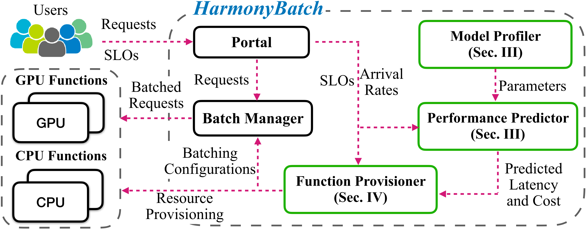

# HarmonyBatch

_HarmonyBatch_, a cost-efficient resource provisioning framework designed to achieve predictable performance for multi-SLO DNN inference with heterogeneous serverless functions

## Prototype of HarmonyBatch
_HarmonyBatch_  comprises mainly three modules: a model profiler, a performance predictor, and a function provisioner. The model profiler profiles the model with both CPU and GPU functions to acquire model-specific and hardware-specific coefficients. The performance predictor can estimate the inference cost using our performance model. It then guides the function provisioner to identify an appropriate group strategy and function provisioning plans that guarantee the SLOs of all applications. The configurations provided by _HarmonyBatch_ include both batch-related configurations and resource-related configurations. The batch-related configurations will be sent to the batch manager to control the request queue and resource-related configurations will be sent to the serverless platform to update the function. 




## Model the Optimization Problem
Given a set of inference applications 
$` \mathcal{W} = \{ w_{1}, w_{2}, ...., w_{n} \} `$ sharing the same DNN model with the inference latency SLO $`\mathcal{S} = \{ s^{w_1}, s^{w_2}, ..., s^{w_n} \}`$ and request arrival rates $`\mathcal{R} = \{ r^{w_1}, r^{w_2}, ..., r^{w_n} \}`$. We categorize the application set $\mathcal{W}$ into several groups $`\mathcal{G} = \{ \mathcal{X}_{1}, \mathcal{X}_{2}, ..., \mathcal{X}_{m} \}`$. Each group $`\mathcal{X} = \{w_{j}, w_{j+1}, ...\}`$ is provisioned with an appropriate CPU or GPU function, with the aim of meeting application SLO requirements while minimizing the total monetary cost. 
Based on our DNN inference performance and cost models, we can formulate the optimization problem as

```math
\begin{align}
    \min_{\mathcal{G}, \mathcal{F}, \mathcal{B}}  & Cost = \sum_{\mathcal{X} \in \mathcal{G}} \eta^{\mathcal{X}} \cdot C^{\mathcal{X}} \\
    s.t. \ \ \ \ 
    &  m^{\mathcal{X}} \geq M^{\mathcal{X}}, \  \forall \ \mathcal{X} \in \mathcal{G} \\
    & b^{\mathcal{X}} \leq \lfloor r^{\mathcal{X}} \cdot T^{\mathcal{X}} \rfloor + 1, \forall \ \mathcal{X} \in \mathcal{G} \\
    &  t^w + L_{max}^{t} \leq s^w, \  \forall \ w \in \mathcal{X}, \ \mathcal{X} \in \mathcal{G}
\end{align}
```
where $\eta^{\mathcal{X}}$ is the proportion of the request arrival rate of group $\mathcal{X}$ to the total request arrival rate. $C^{\mathcal{X}}$ is the average monetary cost of group $\mathcal{X}$.
Each group $\mathcal{X}$ is configured with a function of resource $f^{\mathcal{X}} \in \mathcal{F}$ (i.e., a tuple of vCPU cores $c^{\mathcal{X}}$ and GPU memory $m^{\mathcal{X}}$, $f^{\mathcal{X}} = [c^{\mathcal{X}}, m^{\mathcal{X}}]$).

## Getting Started

### Installation
```shell
git clone https://github.com/HarmonyBatch/HarmonyBatch
pip install requirements.txt
```

### Run the Prototype System

#### Test the Algorithm

Set up the model name (i.g., VGG19) and algorithm name (i.g., HarmonyBatch) within the configuration file in `conf/config.json`.
Set the application SLOs and arrival rates in `main.py` and run the algorithm: 
```python
cd HarmonyBatch
python3 main.py
```
After runing the code, you will get the provisioning plan as follows for example:
```
Provisioning plan:
The configurations of the group 0 is:
cpu:            1.60
batch:          1
rps:            5
timeout:        0.0
cost:           4.350e-05
slo:            0.5
----
The configurations of the group 1 is:
...
```


## Publication

Jiabin Chen, Fei Xu, Yikun Gu, Li Chen, Fangming Liu, Zhi Zhou, “HarmonyBatch: Batching multi-SLO DNN Inference with Heterogeneous Serverless Functions,” in Proc. of IEEE/ACM IWQoS 2024, June 19–21, 2024. (CCF-B)

We have also uploaded our paper to [arxiv](http://arxiv.org/abs/2405.05633), and we would encourage anybody interested in our work to cite our paper. Our paper has been accepted by IWQoS2024.

```
@misc{chen2024harmonybatch,
      title={HarmonyBatch: Batching multi-SLO DNN Inference with Heterogeneous Serverless Functions}, 
      author={Jiabin Chen and Fei Xu and Yikun Gu and Li Chen and Fangming Liu and Zhi Zhou},
      year={2024},
      eprint={2405.05633},
      archivePrefix={arXiv},
      primaryClass={cs.DC}
}
```

